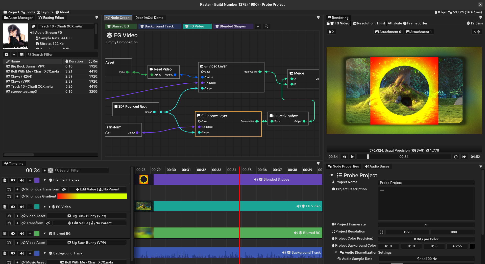

<h1 align="center">Raster [Work in Progress]</h1>

Raster is a GPU Accelerated Node Video Editor with unlimited functionallity!

Currently Raster is not suitable for everyday use, but it improves every day.

## Current state of Raster

Main features:
* Node based architecture
* Fully GPU accelerated custom rendering pipeline (OpenGL ES 3.2)
* Advanced audio processing capabilities (pitch shifting, time stretching, audio effects)
* Support for Bezier curves, Catmull-Rom curves, lines and gradients
* Video decoding and caching system
* Color grading and colorspaces support using OpenColorIO

## Building
Raster uses custom build system which is specifically tailored for compiling lots of build targets.

Currently, Linux is the only supported platform. Windows is in theory supported too, but bulilding for Windows is not heavily tested.

How to build:
* Run `build.sh` or `python build/build.py`
* Install required dependencies, if they're missing (build system will notify you about missing libraries)

After successful compilation binaries of Raster can be found at `dist/`

## Examples
Currently there is no extensive documentation about Raster's functionality. Raster ships with a bunch of example projects, that can be found at Project -> Examples.

Using those examples you can get a preview of Raster's rendering and processing capabilities

## Screenshots

